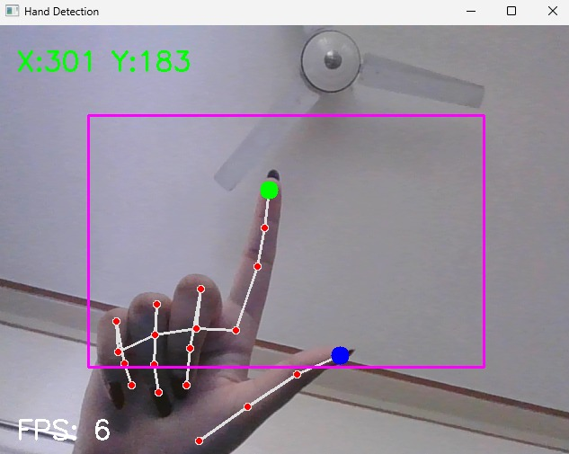

# 🖱️ AI Hand Gesture Mouse

A Python-based virtual mouse system that allows users to control the computer cursor using hand gestures in real-time. This project leverages Computer Vision and Artificial Intelligence techniques to provide a touchless human-computer interaction experience.

---

## 📌 Project Overview

The **AI Hand Gesture Mouse** is an innovative computer vision application that enables users to control mouse operations without physically touching a mouse device. Using a webcam and hand gesture recognition, the system tracks hand movements and translates them into mouse actions.

The project utilizes **OpenCV**, **MediaPipe**, and **PyAutoGUI** to detect hand landmarks and perform real-time cursor control.

---

## ✨ Features

✔️ Real-Time Hand Detection

✔️ Cursor Movement using Index Finger

✔️ Smooth Cursor Tracking

✔️ Left Click Gesture

✔️ Right Click Gesture

✔️ Scroll Up and Scroll Down

✔️ Double Click Gesture

✔️ Touchless Human-Computer Interaction

---

## 🛠️ Technologies Used

* **Python**
* **OpenCV**
* **MediaPipe**
* **PyAutoGUI**
* **Computer Vision**
* **Artificial Intelligence**

---

## 📂 Project Structure

```text
AI-Hand-Gesture-Mouse/
│
├── main.py
├── hand_tracker.py
├── mouse_controller.py
├── requirements.txt
├── README.md
├── .gitignore
└── screenshots/
    └── demo.png
```

---

## ⚙️ Installation

### 1. Clone the Repository

```bash
git clone https://github.com/Javeria-05/AI-Hand-Gesture-Mouse.git
```

### 2. Navigate to the Project Directory

```bash
cd AI-Hand-Gesture-Mouse
```

### 3. Create Virtual Environment

```bash
python -m venv venv
```

### 4. Activate Virtual Environment

**Windows**

```bash
venv\Scripts\activate
```

### 5. Install Required Dependencies

```bash
pip install -r requirements.txt
```

### 6. Run the Project

```bash
python main.py
```

---

## 🎯 Gesture Controls

| Gesture               | Action          |
| --------------------- | --------------- |
| Index Finger Movement | Cursor Movement |
| Thumb + Index Finger  | Left Click      |
| Index + Middle Finger | Right Click     |
| Middle Finger Up      | Scroll Up       |
| Middle Finger Down    | Scroll Down     |
| Thumb + Ring Finger   | Double Click    |

---

## 🧠 How It Works

1. The webcam captures live video frames.
2. MediaPipe detects hand landmarks in real-time.
3. The index finger coordinates are mapped to screen coordinates.
4. Specific finger combinations trigger different mouse actions.
5. PyAutoGUI executes mouse operations on the operating system.

---

## 🚀 Future Enhancements

* Drag and Drop Support
* Screenshot Capture Gesture
* Volume Control
* Brightness Control
* Presentation Mode
* Multi-Hand Support
* Gesture Customization

---

## 📸 Demo



The pink rectangle shows the active tracking region — moving the index finger within this box controls the cursor across the full screen.

---

## 👩‍💻 Developer

**Javeria**

GitHub: https://github.com/Javeria-05

---

## ⭐ Support

If you found this project helpful, please consider giving it a **star ⭐** on GitHub.

---

## 📜 License

This project is licensed under the MIT License.